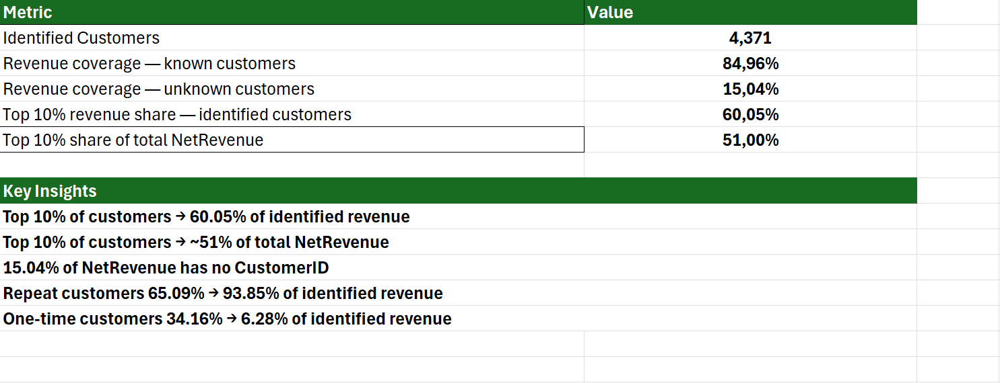
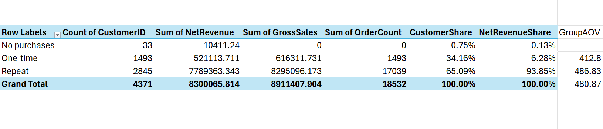

# Online Retail Customer Analysis

Excel-based customer analysis focused on revenue concentration, repeat customer behavior, and the impact of missing CustomerID values.

## Goal

The main goal was to understand:

- how strongly revenue depends on a small group of customers;
- how important repeat customers are;
- how missing CustomerID values affect the analysis.

## Tools

- Microsoft Excel
- Power Query
- PivotTables

## Methodology

1. Loaded and cleaned the transaction data with Power Query.
2. Checked missing values and possible duplicate rows.
3. Calculated NetRevenue from sales and negative transactions.
4. Aggregated transactions by CustomerID.
5. Segmented customers into repeat, one-time, and no-purchase groups.
6. Ranked customers by NetRevenue and calculated cumulative revenue share.
7. Compared customer-level revenue with total dataset revenue.

## Key Findings

- Top 10% of identified customers generate 60.05% of identified customer revenue.
- These customers generate about 51% of total NetRevenue.
- Repeat customers represent 65.09% of identified customers but generate 93.85% of identified revenue.
- One-time customers represent 34.16% of customers but generate only 6.28% of identified revenue.
- 15.04% of total NetRevenue cannot be linked to a CustomerID.

## Data Limitation

Customer-level analysis was performed only for transactions with a known CustomerID.

Customers with known CustomerID represent 84.96% of total NetRevenue. The remaining 15.04% cannot be reliably attributed to individual customers.

## Screenshots

### Analysis Summary

### Customer Segmentation

